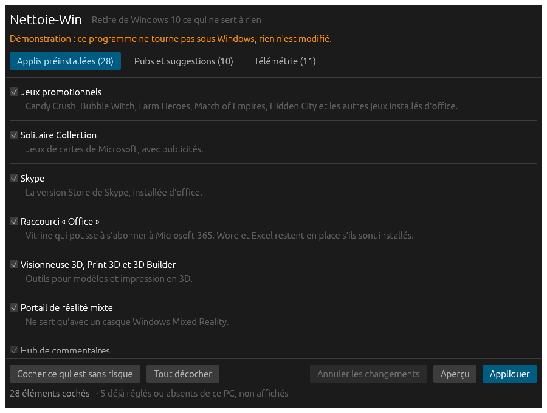

# Nettoie-Win

Un seul fichier `Nettoie-Win.exe` pour Windows 10 qui retire ce qui ne sert à rien :

- **Applis préinstallées** : Candy Crush et autres jeux promotionnels, Solitaire, Skype, raccourci Office, applis 3D, Hub de commentaires…
- **Pubs et suggestions** : applis installées sans demander, suggestions du menu Démarrer, astuces de l'écran de verrouillage, recherche Bing dans le menu, bouton « Actualités » de la barre des tâches…
- **Télémétrie** : services et tâches de collecte, identifiant de publicité, historique d'activité, collecte de la saisie…



*Capture prise en mode démonstration, hors de Windows.*

## Téléchargement

[Nettoie-Win.exe](https://github.com/ManBoyx/nettoie-win/releases/latest) — un seul fichier, rien à installer.

**Première version.** Elle est vérifiée par des tests automatiques sur un Windows simulé, pas encore sur un grand nombre de vrais PC. Pour un premier essai : regarder **Aperçu**, appliquer deux ou trois éléments, puis vérifier que **Annuler les changements** les remet.

## Utilisation

1. Lancer `Nettoie-Win.exe` et accepter la demande de droits d'administrateur.
2. Le programme analyse le PC et n'affiche que ce qui s'y trouve réellement.
3. Cocher ou décocher. Ce qui est sans risque est déjà coché ; ce qui peut manquer à quelqu'un (Xbox, OneDrive, Photos, Calculatrice…) est proposé mais décoché.
4. **Aperçu** montre le détail de ce qui sera fait, sans rien toucher.
5. **Appliquer** crée un point de restauration Windows, puis fait les changements.
6. Redémarrer le PC.

## Revenir en arrière

- **Annuler les changements** remet les réglages, services et tâches dans leur état d'origine. L'ancienne valeur de chacun est notée avant d'être modifiée, dans `%LOCALAPPDATA%\Nettoie-Win\journal.json`.
- Les **applis retirées ne reviennent pas** par ce bouton : elles se réinstallent depuis le Microsoft Store.
- Le point de restauration Windows reste le filet de dernier recours (Panneau de configuration → Récupération → Ouvrir la Restauration du système).

## Ce que le programme ne touche jamais

Windows Update, Microsoft Defender, le Microsoft Store, Edge, les pilotes et leurs panneaux de réglage, .NET et les bibliothèques Visual C++. Une liste de noms protégés est vérifiée à trois endroits (analyse, exécution, commande envoyée à Windows).

## À savoir

- Le fichier n'est pas signé : Windows affiche « éditeur inconnu » au lancement. Un antivirus peut aussi le signaler, comme tous les outils de ce genre.
- Les réglages « par compte » s'appliquent au compte qui donne les droits d'administrateur. Sur un compte standard où l'on tape le mot de passe d'un autre compte, c'est cet autre compte qui est réglé.
- Après certains réglages, l'appli Paramètres affiche « Certains paramètres sont gérés par votre organisation » : c'est normal, ils passent par les stratégies de Windows.
- Une grosse mise à jour de Windows 10 peut réinstaller des applis ou remettre des réglages. Il suffit de relancer le programme.
- Prévu pour Windows 10. Sous Windows 11, une partie des éléments n'existe pas et ne sera simplement pas proposée.

## Compilation

Rust, compilé depuis Linux pour Windows avec `cargo-zigbuild` :

```
cargo zigbuild --release --target x86_64-pc-windows-gnu
```

Le résultat est `target/x86_64-pc-windows-gnu/release/Nettoie-Win.exe`.

## Tests

```
cargo test --no-default-features     # la logique seule, en quelques secondes
cargo test                           # avec la fenêtre, pilotée sans écran
cargo test --test fenetre captures -- --ignored   # images de contrôle dans captures/
```

Les tests tournent sur un faux Windows en mémoire (`src/faux.rs`). Lancé hors de Windows, le programme s'ouvre sur ce même faux PC, en mode démonstration.

## Organisation du code

| Fichier | Rôle |
|---|---|
| `src/catalogue.rs` | La liste de tout ce qui peut être retiré ou réglé, et la liste protégée. Ajouter un élément = ajouter une entrée ici. |
| `src/analyse.rs` | Compare le catalogue à l'état du PC. |
| `src/execution.rs` | Fait les changements, un par un. |
| `src/journal.rs` | Note l'état d'avant et sait le remettre. |
| `src/systeme.rs` | Ce que le programme demande à Windows (interface). |
| `src/windows.rs` | La vraie version : registre, `sc`, `schtasks`, PowerShell. |
| `src/texte.rs` | Fabrication des commandes et lecture de leurs réponses. |
| `src/moteur.rs` | Fil de travail, pour que la fenêtre ne se fige pas. |
| `src/interface.rs` | La fenêtre. |
